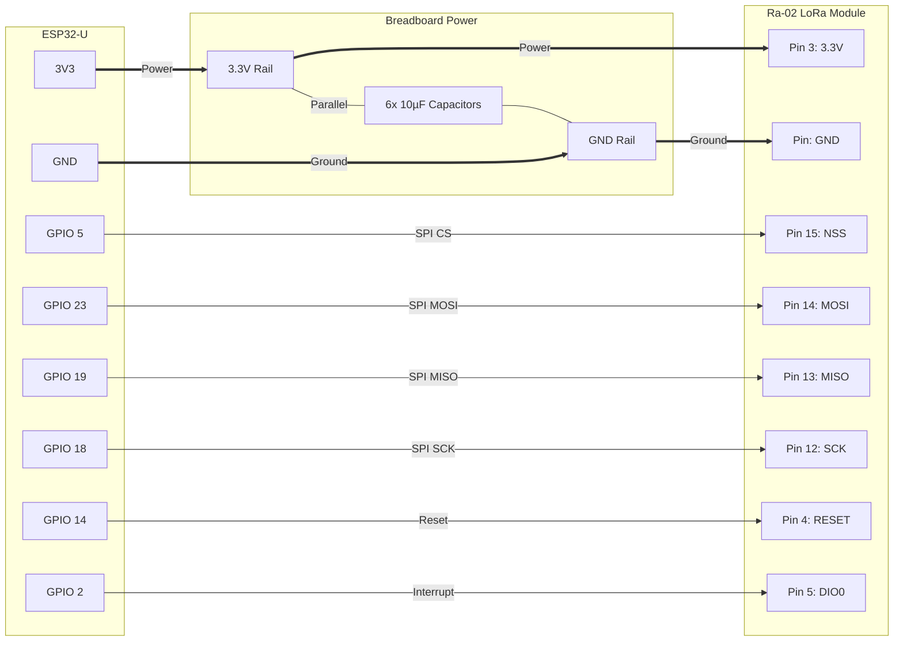

# LoRaLink-Intranet (ESP32 + Ra-02 / SX1278)

This repository contains **two PlatformIO projects** for testing LoRa communication using:
- **ESP32 (esp32dev)**
- **Ai-Thinker Ra-02 (SX1278)** LoRa modules
- Arduino framework + `sandeepmistry/LoRa`

## Projects in this Repo

- **`LoRa_Sender/`** — Transmits `"Test Packet N"` every ~3 seconds
- **`LoRa_Receive/`** — Receives packets and prints the payload + RSSI

Each folder is a standalone PlatformIO project (separate `platformio.ini`, `src/main.cpp`, etc.).

---

## Hardware Requirements

For a full Sender/Receiver test (recommended), you need:

- 2× ESP32 development boards
- 2× Ra-02 (SX1278) LoRa modules
- Breadboard + jumper wires
- **6× 10 µF capacitors** (recommended for power stabilization)
- USB cables

---

## Wiring Guide

| Ra-02 Pin | Purpose | ESP32-U GPIO Pin |
| :--- | :--- | :--- |
| Pin 3 (3.3V) | Power (VCC) | 3V3 |
| Pin 1, 2, 9, or 16 (GND)| Ground | GND |
| Pin 15 (NSS) | Chip Select (CS) | GPIO 5 |
| Pin 14 (MOSI) | SPI Data Out | GPIO 23 |
| Pin 13 (MISO) | SPI Data In | GPIO 19 |
| Pin 12 (SCK) | SPI Clock | GPIO 18 |
| Pin 4 (RESET) | Reset | GPIO 14 |
| Pin 5 (DIO0) | Interrupt Request | GPIO 2 |

**Important Power Note:** The Ra-02 module can draw significant current, particularly during transmission. Place the six 10 µF capacitors in parallel across the 3.3V and GND rails on your breadboard to stabilize the power supply and prevent brownouts or resets.

### Wiring Diagram



---

## Software Setup

This repo uses **PlatformIO** (VS Code).

Common settings:
- Framework: Arduino
- Serial monitor: `115200`

Library dependency:
- `sandeepmistry/LoRa`

---

## Quick Start: Run Sender + Receiver (Recommended)

### 1) Clone the repository
```bash
git clone https://github.com/kawdoco/LoRaLink-Intranet.git
cd LoRaLink-Intranet
```

### 2) Build & Upload the Sender (`LoRa_Sender/`)
1. Open the **`LoRa_Sender/`** folder in VS Code (PlatformIO).
2. Connect **Board A** (ESP32 + Ra-02).
3. Click **Build** then **Upload**.
4. Open Serial Monitor @ `115200`.

Expected output:
```
LoRa Sender Node
Sending: Test Packet 0
Sending: Test Packet 1
...
```

### 3) Build & Upload the Receiver (`LoRa_Receive/`)
1. Open the **`LoRa_Receive/`** folder in VS Code (PlatformIO).
2. Connect **Board B** (ESP32 + Ra-02).
3. Click **Build** then **Upload**.
4. Open Serial Monitor @ `115200`.

Expected output:
```
LoRa Receiver Node
Received packet 'Test Packet 0' with RSSI -XX
Received packet 'Test Packet 1' with RSSI -XX
...
```

---

## Frequency / Region Notes (Must Match on Both)

Both projects currently use **433 MHz** in code. If you change frequency for your region (e.g., 868 MHz or 915 MHz), update it in **both**:
- `LoRa_Sender/src/main.cpp`
- `LoRa_Receive/src/main.cpp`

---

## Troubleshooting

### “Starting LoRa failed!”
Most common causes:
- SPI wiring mismatch (NSS/MOSI/MISO/SCK)
- Incorrect RESET or DIO0 pin wiring
- Unstable 3.3V power (use the recommended capacitors and short wires)

### Sender prints “Sending…” but receiver gets nothing
Check:
- Both are on the same frequency
- Both devices have antennas installed
- Distance/placement (start close, then increase range)
- Power stability on both modules

---

## Notes / Safety

- Follow local radio regulations for 433/868/915 MHz usage.
- Avoid transmitting without a proper antenna.
